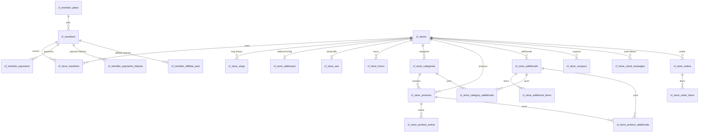
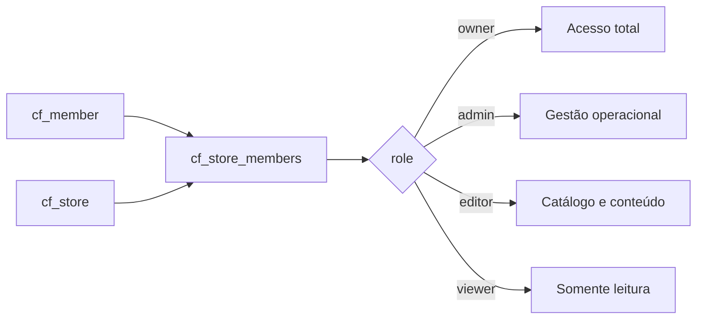
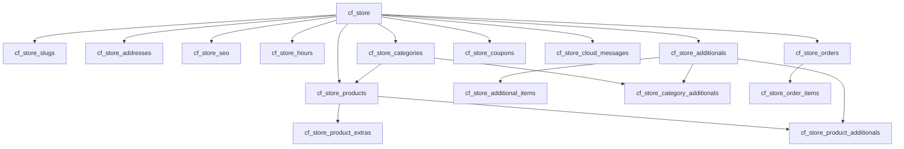

# CardápioFast — Nova Arquitetura Multi-Loja

## Objetivo

Reestruturar o domínio atual para permitir:

- 1 `cf_member` com N lojas
- múltiplos membros por loja com níveis de acesso
- separação entre **conta administrativa** e **operação da loja**
- manutenção do conjunto de tabelas já existente no projeto, reorganizado corretamente

## Raiz do domínio

### Conta administrativa
- `cf_members`
- `cf_member_plans`
- `cf_member_payments`
- `cf_member_payments_failures`
- `cf_member_affiliate_paid`

### Multi-loja
- `cf_stores`
- `cf_store_members`

### Operação da loja
- `cf_store_slugs`
- `cf_store_addresses`
- `cf_store_seo`
- `cf_store_hours`
- `cf_store_categories`
- `cf_store_products`
- `cf_store_product_extras`
- `cf_store_additionals`
- `cf_store_additional_items`
- `cf_store_category_additionals`
- `cf_store_product_additionals`
- `cf_store_coupons`
- `cf_store_cloud_messages`
- `cf_store_orders`
- `cf_store_order_items`

### Infra / integração
- `cf_password_resets`
- `cf_failed_jobs`
- `cf_pagarme_transactions`

---

## Mapeamento antigo → novo

| Antigo | Novo |
|---|---|
| `members` | `cf_members` |
| `member_plans` | `cf_member_plans` |
| `member_payments` | `cf_member_payments` |
| `member_payments_failure` | `cf_member_payments_failures` |
| `member_affiliate_paid` | `cf_member_affiliate_paid` |
| `member_slug` | `cf_store_slugs` |
| `member_address` | `cf_store_addresses` |
| `member_seo` | `cf_store_seo` |
| `member_hours` | `cf_store_hours` |
| `member_category` | `cf_store_categories` |
| `member_products` | `cf_store_products` |
| `member_products_extra` | `cf_store_product_extras` |
| `member_additional` | `cf_store_additionals` |
| `member_additional_items` | `cf_store_additional_items` |
| `member_category_additional` | `cf_store_category_additionals` |
| `member_product_additional` | `cf_store_product_additionals` |
| `member_coupon` | `cf_store_coupons` |
| `member_cloud_message` | `cf_store_cloud_messages` |
| `store_orders` | `cf_store_orders` |
| _novo_ | `cf_stores` |
| _novo_ | `cf_store_members` |
| _novo_ | `cf_store_order_items` |

---

## Regras principais

### 1. Dono do negócio
Tudo que é catálogo, SEO, pedido, endereço comercial, horário e cupom passa a pertencer à loja:

- `store_fk`

### 2. Conta administrativa
Tudo que é autenticação, plano, pagamento da assinatura e afiliado continua pertencendo ao membro:

- `member_fk`

### 3. Permissão por loja
Níveis de acesso ficam na tabela:

- `cf_store_members`

Papéis sugeridos:

- `owner`
- `admin`
- `editor`
- `viewer`

---

## Diagrama ER

---

## Fluxo de acesso

---

## Fluxo operacional da loja

---

## Ordem sugerida das migrations

1. `cf_member_plans`
2. `cf_members`
3. `cf_password_resets`
4. `cf_failed_jobs`
5. `cf_stores`
6. `cf_store_members`
7. `cf_store_slugs`
8. `cf_store_addresses`
9. `cf_store_seo`
10. `cf_store_hours`
11. `cf_store_categories`
12. `cf_store_products`
13. `cf_store_product_extras`
14. `cf_store_additionals`
15. `cf_store_additional_items`
16. `cf_store_category_additionals`
17. `cf_store_product_additionals`
18. `cf_store_coupons`
19. `cf_store_cloud_messages`
20. `cf_store_orders`
21. `cf_store_order_items`
22. `cf_member_payments`
23. `cf_member_payments_failures`
24. `cf_member_affiliate_paid`
25. `cf_pagarme_transactions`

---

## Observações de modelagem

- Todas as tabelas possuem `uuid`.
- As foreign keys usam UUID para manter o estilo do projeto atual.
- Mantive a maior parte das colunas do domínio já existente.
- O maior ajuste foi mover a raiz das tabelas operacionais de `member_fk` para `store_fk`.
- `cf_store_order_items` foi adicionada para normalizar itens de pedido; `cf_store_orders` ainda preserva campos legados de payload textual.
