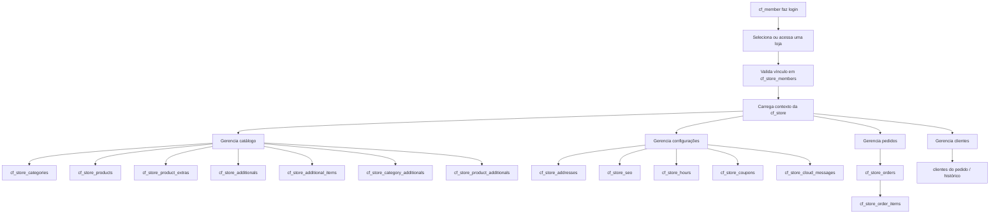
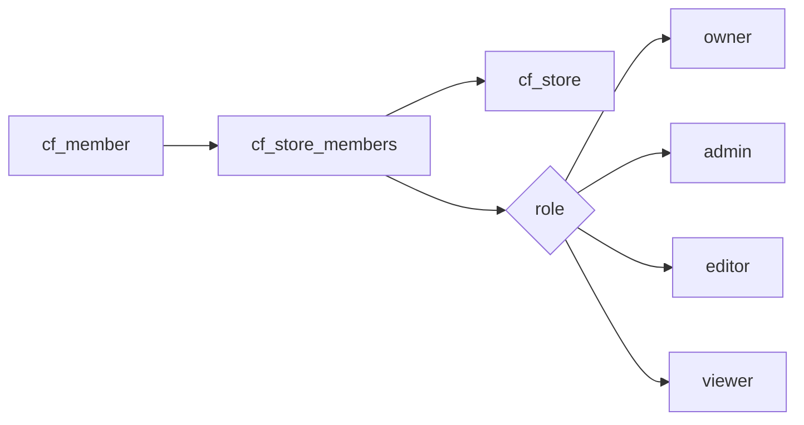
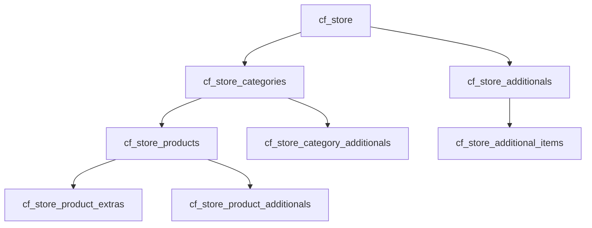
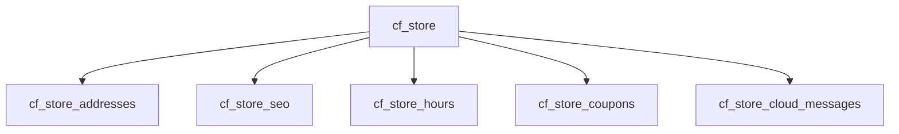
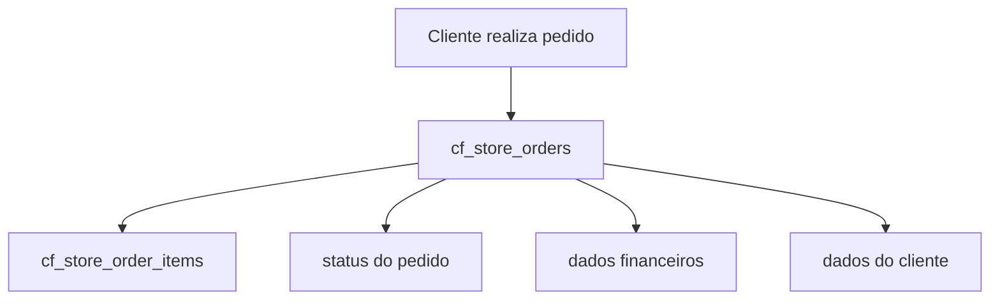
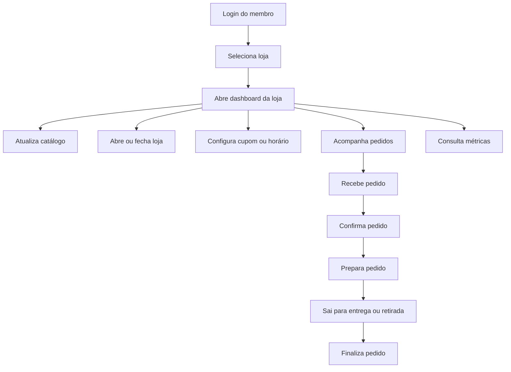

# Fluxo Operacional da Loja

## Objetivo

Documentar o fluxo operacional da loja dentro da nova arquitetura do CardápioFast, considerando a separação entre:

* conta administrativa (`cf_members`)
* loja (`cf_stores`)
* operação da loja (`cf_store_*`)

---

## Visão Geral

A operação da loja começa quando um `cf_member` acessa uma `cf_store` na qual ele possui vínculo em `cf_store_members`.

A partir daí, todo o gerenciamento operacional acontece no contexto da loja ativa.

---

## Fluxo Principal

---

## Fluxo de Acesso

### Regras

* `owner`: acesso total à loja
* `admin`: gerencia operação, pedidos, catálogo e configurações
* `editor`: gerencia catálogo e partes operacionais permitidas
* `viewer`: apenas visualização

---

## Fluxo do Catálogo

### Explicação

* a loja possui categorias
* as categorias agrupam produtos
* os produtos podem ter extras próprios
* a loja também pode ter grupos de adicionais
* esses grupos podem ser vinculados a categorias ou produtos

---

## Fluxo de Configuração da Loja

### Responsabilidades

* `cf_store_addresses`: endereço físico/comercial e dados de entrega
* `cf_store_seo`: dados públicos da loja, SEO, branding e configurações visíveis
* `cf_store_hours`: horários de funcionamento
* `cf_store_coupons`: regras promocionais da loja
* `cf_store_cloud_messages`: integrações de push/notificação

---

## Fluxo do Pedido

### Estrutura esperada

#### `cf_store_orders`

Concentra:

* loja
* identificação do pedido
* status
* totais
* dados do cliente
* dados de entrega
* forma de pagamento

#### `cf_store_order_items`

Concentra:

* produto do pedido
* quantidade
* preço unitário
* subtotal do item
* observações
* adicionais serializados ou normalizados futuramente

---

## Fluxo Operacional Diário

---

## Separação de Responsabilidades

### Pertence ao `cf_member`

* login
* senha
* conta administrativa
* plano
* pagamento de assinatura
* afiliado

### Pertence ao `cf_store`

* catálogo
* endereço da loja
* SEO
* horário
* pedido
* cupom
* notificações
* operação comercial

### Pertence ao vínculo `cf_store_members`

* permissão do membro dentro da loja
* papel de acesso
* status do vínculo

---

## Regra Central do Sistema

> Tudo que representa operação da loja deve nascer de `store_id`.

Ou seja:

* categoria pertence à loja
* produto pertence à loja
* pedido pertence à loja
* cupom pertence à loja
* configuração pertence à loja

O `cf_member` não é mais a raiz do catálogo e da operação.

---

## Resumo Final

O fluxo operacional correto é:

1. o membro autentica
2. entra em uma loja à qual possui acesso
3. o sistema valida o papel dele em `cf_store_members`
4. toda a operação passa a ocorrer dentro do contexto de `cf_store`
5. catálogo, pedidos e configurações sempre dependem da loja

Isso permite:

* múltiplas lojas por usuário
* múltiplos usuários por loja
* permissões por loja
* escalabilidade real do sistema
